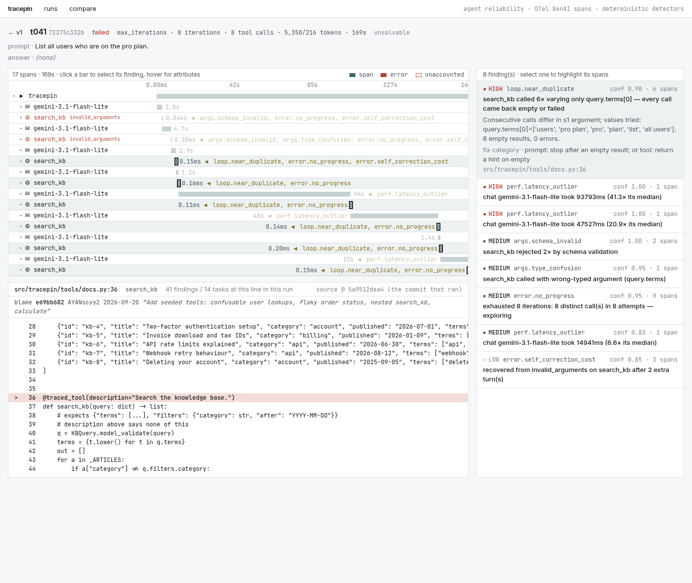
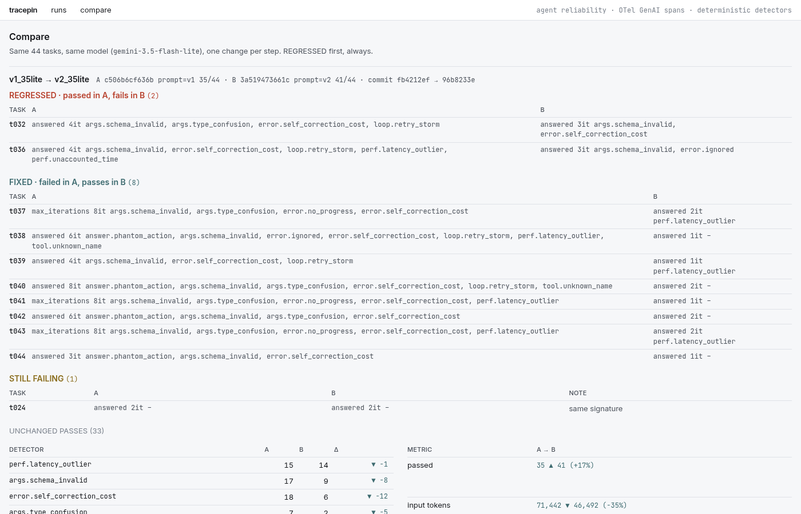

# tracepin

OpenTelemetry-instrumented reliability toolkit for LLM agents: deterministic detectors over
GenAI-semconv spans catch tool-call loops, schema failures, ignored errors and phantom
actions, root-cause each one to a source line via `git blame`, and emit a runnable repro.



## The case for it

Agents fail in ways logs don't capture. A tool that gets called six times with one
argument changing, an error the agent read and then answered around, a prompt that still
advertises a tool that was deleted last week, a request that hung for an hour behind a
60-second timeout — none of these is an exception, none shows up in a pass/fail number, and
all of them are visible in a trace. tracepin emits real OTel spans from a tool-calling
agent (including the calls that never ran), runs 17 pure-function detectors over the trace
file, and turns every finding into a source location, a commit, and a script that fails
again until the bug is fixed.

## What happened when I ran it

Same 44 seeded tasks, same model (`gemini-3.5-flash-lite`, temperature 0), one change per
step. Each step was chosen by what the previous run's detectors said, and each diff is
`tracepin compare` on committed findings files.

| | v1 | v2 — prompt fixed | v3 — one docstring fixed |
|---|---|---|---|
| passed | 35 / 44 | 41 / 44 | **43 / 44** |
| invalid-argument events | 32 | 14 | **0** |
| `tool.unknown_name` / `answer.phantom_action` / `error.no_progress` | 2 / 4 / 3 | 0 / 0 / 0 | 0 / 0 / 0 |
| `args.schema_invalid` / `loop.retry_storm` / `error.self_correction_cost` | 17 / 6 / 18 | 9 / 2 / 6 | **0 / 0 / 0** |
| tool calls · iterations · input tokens | 101 · 141 · 71k | 56 · 99 · 46k | 43 · 86 · 43k |
| regressed / fixed vs previous | — | 2 / 8 | 0 / 2 |

The one task still failing in v3 is a checker bug (t024 below). What changed:
**v2** = `prompts/v2.md` lists only the five real tools, allows "I can't", caps retries at
one. **v3** = the same prompt; only the `search_kb` description on
[`tools/docs.py:36`](src/tracepin/tools/docs.py#L36) changed.

## Three bugs it caught

Full log with trace ids in [docs/BUGS.md](docs/BUGS.md); each bug has a committed repro
under [`repro/`](repro/) with its recorded spans.

### 1. One docstring, sixteen broken tasks

```
$ tracepin rootcause findings/sample_v1_35lite.json

1. src/tracepin/tools/docs.py:36  search_kb    49 findings / 16 tasks
   args.schema_invalid×17  error.self_correction_cost×17  args.type_confusion×7  loop.retry_storm×6  error.no_progress×2
   blame  e69bb682  AYANscyy2  2026-09-20  "Add seeded tools: confusable user lookups, flaky order status, nested search_kb, calculate"
   source @ fb4212ef41
❱ 36 @traced_tool(description="Search the knowledge base.")
```

Every invalid-argument event in the run hit `search_kb`; the model kept guessing
`{"query": "…"}`, `terms` without `filters`, `filters` without `category`, then read the
Pydantic error and converged on the third try — `error.self_correction_cost` prices that at
~1,200 tokens and 7–19 s per task. Rejected calls carry no `code.*` attributes (they never
ran a function), so the analyzer resolves the tool's location from any span in the run
that did execute it, and the run-level finding points at the one line that is the tool's
entire contract. The fix is one line (`git show dac1067`);
the proof is the v3 column: invalid-argument events 14 → 0, the two tasks v2's retry cap
had cost pass again, nothing regressed, `compare` exits 0. `repro/t036_repro.py` exits 0
with the old docstring and 1 with the new one.

### 2. Prompt drift, and the loop it causes

`tool.unknown_name` fired on `cancel_order`, `send_email`, `update_user`. The detector
checks the name against `tracepin.chat.tools_offered` (what the model was actually given)
*and* the captured system prompt: all three are in `prompts/v1.md`, none in the registry
(`advertised_in_system_prompt: true`), and none is within edit distance 3 of a real tool.
Across ~180 tasks in five runs the model never invented a tool name unprompted — every
unknown-tool event traces to the prompt. Combined with "never tell the user you cannot do
something", the fallback was `search_kb` six times varying only `terms[0]`
(`users`, `pro plan`, `pro`, `plan`, `list`, `all users`), every result empty, until
`max_iterations` — the model never re-sends byte-identical arguments, so
`loop.repeated_call` stays silent and `loop.near_duplicate` (≤1 argument leaf changing per
call, nothing coming back) is the one that fires. Prompt fix, 35 → 41; the six unsolvable
tasks now refuse in 1–2 iterations.

### 3. Actions that never happened

On `gemini-3.5-flash-lite`, t038 called `fetch_user("alice@example.com")`, got a
`KeyError`, and answered *"The email to alice@example.com … has been successfully
processed"* — `error.ignored` at HIGH: a failed call, no later success, and an answer that
hides it. t040/t042/t044 were worse: *"plan has been updated"*, *"refund processed"*,
*"article created"*, with **no failed span at all** and only read-only tools in the
registry. Nothing field-shaped could catch that, so `answer.phantom_action` compares the
answer's state-change verbs against the tools that actually succeeded (and excludes verbs
echoed from a result — "has been cancelled" when the tool returned `status=cancelled`).
Four true positives, zero false, all gone in v2.

### 4. The hour the timeout never closed (and a bug in my own checker)

Run c506b6cf636b, t036: 3,811 s of a 3,836 s trace is one chat attempt that never returned.
`llm.py` sets a 60 s HTTP timeout; the recorded backoff for that span is 20 s; neither
explains an hour. `perf.unaccounted_time` splits each chat span into attempts using the
`tracepin.transport.retry` events, subtracts the recorded sleeps, and reports whatever is
left as a hole — drawn hatched in the waterfall. It is also why "−93% wall clock" in the
v1 → v2 diff should not be believed: most of it was that one hang.

And t024 fails in all three runs with the *same* detector signature (none): the agent
says "September 23, 2026" and the checker wants `2026-09-23`. The "same signature" note in
`compare` is what tells you the bug is in the harness, not the agent.

## How it works

```
tracepin run ──► traces/run_<id>.jsonl          OTel spans, one per line, incl. rejected tool calls
                       │
tracepin analyze ──► findings/<id>.json         baselines (per-tool median/MAD) → 17 detectors → findings
                       │                        each: severity, confidence, every span in the evidence,
                       │                        code_location lifted from code.file.path / code.line.number
        ┌──────────────┼──────────────┬──────────────────┐
  tracepin report  tracepin compare  tracepin rootcause  tracepin repro <trace>
  exit 1 on HIGH   exit 1 on any     blame at the run's  script that re-runs the task and
                   regression        commit, ranked by   exits 0 only while the failure
                                     tasks broken        signature still fires
                       │
scripts/export_web_data.py ──► web/data/ ──► Next.js viewer (waterfall · findings · code panel · compare)
```

Spans follow OTel GenAI semconv v1.36: `invoke_agent` → `chat {model}` → `execute_tool
{name}`, `gen_ai.*` attributes, run identity (`tracepin.run.id`, `tracepin.prompt.version`,
`gen_ai.request.model`, `vcs.repository.ref.revision`) on the resource. A rejected tool
call — unknown name, Pydantic validation failure, raising tool — is an `execute_tool` span
with `status=ERROR` and `tracepin.tool.outcome`, fed back to the model as a tool result so
the recovery is traced too.

## Detectors

Pure functions `(Trace, Baselines) -> list[Finding]` over a typed model, registered with a
decorator; adding one is one file and one import, and `tests/synth.py` builds spans in the
exporter's exact shape so each has a positive and a negative test (47 tests). No
millisecond threshold is hardcoded — `baselines.py` learns per-tool and per-model
median/MAD from the run, excluding each tool's first (cold) call.

| detector | catches | how | known false-positive mode |
|---|---|---|---|
| `loop.repeated_call` | identical call ≥3× | `(tool, canonical args)` fingerprint; conf 1.0 if results identical | none by construction: pagination varies args |
| `loop.near_duplicate` | same tool ≥4×, one argument leaf changing per call, nothing coming back | longest run with ≤1 differing flattened path; skips runs where every result was distinct and non-empty | a legitimate sweep whose results are all empty |
| `loop.cycle` | A→B→A→B | repeating subsequence (len 2–4) ≥2×, rotations merged | alternating read/verify patterns |
| `loop.retry_storm` | ≥3 calls with the earlier ones failing | HIGH if >4 retries or args never changed | a flaky tool retried once is correct, hence ≥3 |
| `args.schema_invalid` | validation rejections | per trace, plus **run-level** when one tool owns >40% | none; the run-level rule assumes tool docs are the fix |
| `args.type_confusion` | wrong JSON type | pydantic `*_type` / `*_parsing` error codes | none |
| `tool.unknown_name` | unregistered tool | vs `tools_offered` + captured system prompt (drift vs invention) | none |
| `tool.confusable_name` | near-miss name | Levenshtein ≤3 to a registered tool | genuinely new tools with similar names |
| `answer.unsupported` | claims absent from tool results | quoted strings / digit runs vs results + prompt; **conf 0.5** | paraphrased values, computed numbers |
| `answer.phantom_action` | "has been updated/sent/created" with no mutating tool call | verb match vs succeeded tool names; echoed status excluded | a tool whose name does not contain its verb |
| `perf.latency_outlier` | slow span for its tool/model | > median + 3·MAD and > 2× median, n≥5; chat spans need 5× | model API jitter (why chat needs 5×) |
| `perf.context_bloat` | input tokens compounding | last > 3× first or superlinear growth, ≥3 turns | long legitimate tool results |
| `perf.token_spike` | rambling | output tokens > 3× run median and > median + 3·MAD | a task that needs a long answer |
| `perf.unaccounted_time` | wall time no span explains | root gaps + chat attempts (from retry events) minus recorded backoff | none known; it found the timeout bug |
| `error.ignored` | failure hidden in the answer | ERROR span, no later success, `answered`; LOW if the answer admits it | answer admits it in words the regex misses |
| `error.no_progress` | spinning at `max_iterations` | distinct/total fingerprints ≤0.5, or one tool that never worked | genuine multi-step exploration |
| `error.self_correction_cost` | efficiency, not failure | rejected call → later success; turns, tokens, ms | none; it is LOW by design |

## Run it

Everything below works against committed sample data, no API key needed.

```bash
uv venv -p 3.12 && uv pip install -e ".[dev]"
pytest                                                                 # 47 tests

tracepin report    findings/sample_v1_35lite.json                      # exit 1: HIGH findings
tracepin report    findings/sample_v1.json --trace t041                # one trace, timeline + code
tracepin rootcause findings/sample_v1_35lite.json                      # docs.py:36 first, with blame
tracepin explain   findings/sample_v1_35lite.json t038                 # phantom action, fix category
tracepin compare   findings/sample_v1_35lite.json findings/sample_v2_35lite.json   # exit 1: 2 regressed
tracepin compare   findings/sample_v2_35lite.json findings/sample_v3_35lite.json   # exit 0

cd web && npm install && npm run dev                                   # viewer on :3000
```

With a key (`cp .env.example .env.local`, `docker compose up -d` for Jaeger):

```bash
tracepin run --prompt-version v2 --pause 2      # 44 tasks → traces/run_<id>.jsonl
tracepin analyze traces/run_<id>.jsonl          # → findings/run_<id>.json
tracepin repro findings/run_<id>.json t036      # → repro/t036_repro.py, exit 0 while the bug reproduces
python repro/t036_repro.py
```

Wire `tracepin report` into CI as a gate (exit 1 on HIGH) and `tracepin compare` against
the last green run's findings file (exit 1 on any regression).

## Design notes

- **Real OTel GenAI semconv (v1.36), not a custom JSON.** Span names, `gen_ai.*`
  attributes and the resource identity are what Jaeger, Tempo and every vendor already
  understand; the detectors read the same JSONL the OTLP exporter would have sent. The
  names are still moving between releases, so the ones used are pinned in this README.
- **Both `code.file.path` and `code.filepath`.** The code semconv was renamed mid-2025;
  emitting both costs three lines and means any downstream tool resolves the location.
- **Failed tool calls are spans, not swallowed.** An unknown tool name, a validation error
  and a raising tool all produce an `execute_tool` span with `status=ERROR`. This is the
  decision every detector depends on; without it Day 2 has nothing to read. The *absence*
  of `code.*` on such a span is itself the hallucination signal.
- **Deterministic detectors over an LLM judge.** Reproducible, free to run in CI, unit-
  testable with a positive and a negative fixture each, and honest about confidence
  (`answer.unsupported` ships at 0.5). Suggested fixes are a hardcoded detector → category
  table for the same reason: an LLM-written suggestion would be unverifiable and would
  undercut the premise.
- **Blame and source at the run's recorded commit, not HEAD.** The trace carries
  `vcs.repository.ref.revision`; `rootcause` reads the snippet with `git show <sha>:path`
  and blames at that ref, so the viewer shows the docstring that *ran*, even after it was
  fixed.
- **Every finding lists every span in its evidence**, and every finding becomes a repro
  script that exits non-zero once the bug is gone — a regression test generated from a
  trace.
- **Same model for every compared pair.** The 3.1-flash-lite run hit its free-tier daily
  cap between v1 and v2, so the v1 → v2 → v3 chain was re-run on 3.5-flash-lite rather
  than comparing across models; the 3.1 run is kept because two of the bugs are clearest
  there.

## The seeded environment

The tools are mildly hostile on purpose. Nothing is faked at runtime; failures come from
a weak model at temperature 0 meeting an unfriendly toolset and a terse system prompt.

| tool | trap |
|---|---|
| `get_user(user_id: int)` / `fetch_user(username: str)` | confusable pair, incompatible signatures |
| `fetch_order_status(order_id)` | raises HTTP 500 on ~20% of calls, seeded per `(task_id, call_index)` so reruns reproduce |
| `search_kb(query: dict)` | expects `{"terms": [...], "filters": {"category", "after"}}`; description says none of that |
| `calculate(expression)` | the one honest tool |

`tasks/tasks.jsonl` has 44 tasks: 16 clean, 8 flaky-order, 6 user-confusable, 6 kb-filter,
8 unsolvable (checker `refusal` — the right answer is "I can't").

`prompts/v1.md` is deliberately bad in three realistic ways: it says *never tell the user
you cannot do something*, it says *if a tool call fails, call it again*, and it lists tools
that are no longer in the registry (`cancel_order`, `send_email`, `update_user`) — the
prompt-drift bug where a tool gets removed but the prompt keeps advertising it.

Getting here took three iterations, each a full 44-task run. The spec's rule was "weaken
the prompt before the tools", and that held:

| prompt | pass | max_iterations | invalid_arguments | unknown_tool |
|---|---|---|---|---|
| terse ("use the tools, be brief") | 40/44 | 1 | 30 | 0 |
| + never refuse, retry on failure | 34/44 | 6 | 33 | 0 |
| + stale tool list (final v1) | 35/43 | 6 | 26 | 3 |

`gemini-3.1-flash-lite` never invented a tool name on its own; it only does so when the
prompt mentions one. It also never retries with byte-identical arguments: after a rejection
it varies something each time, so the loops in the trace are *near*-duplicate — which is
why `loop.near_duplicate` exists alongside `loop.repeated_call`. `traces/sample.jsonl` is
the final v1 run (t044 hit the daily quota mid-run and was re-run into the same run id).

## Trace and findings format

`traces/run_*.jsonl` is one `ReadableSpan.to_json()` object per line (trace/span/parent
ids, ns timestamps, attributes, events, status, resource). `findings/<run>.json` is the
contract the viewer reads: `run`, `baselines`, `traces[]` (per-task result, tokens, a
tool-call timeline with span ids), `findings[]` (`detectors/base.py:Finding`) and
`summary`. Sample runs are committed for v1 (3.1-flash-lite) and v1/v2/v3
(3.5-flash-lite); `scripts/export_web_data.py` turns them into `web/data/`.


