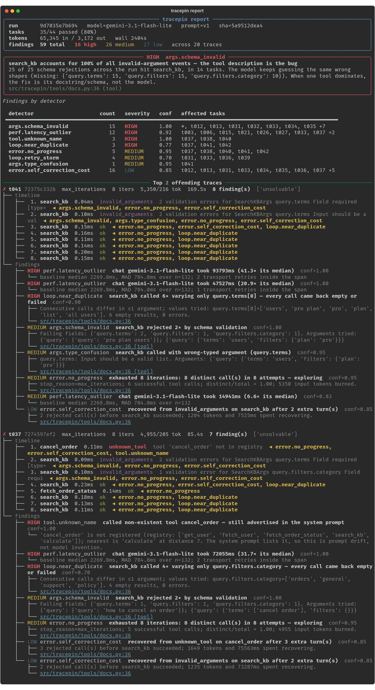
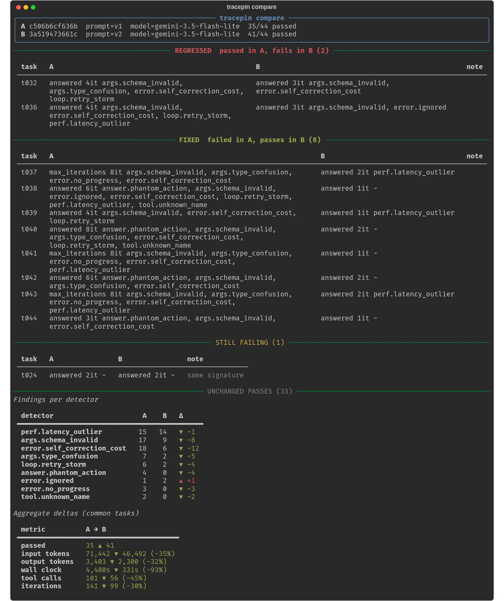
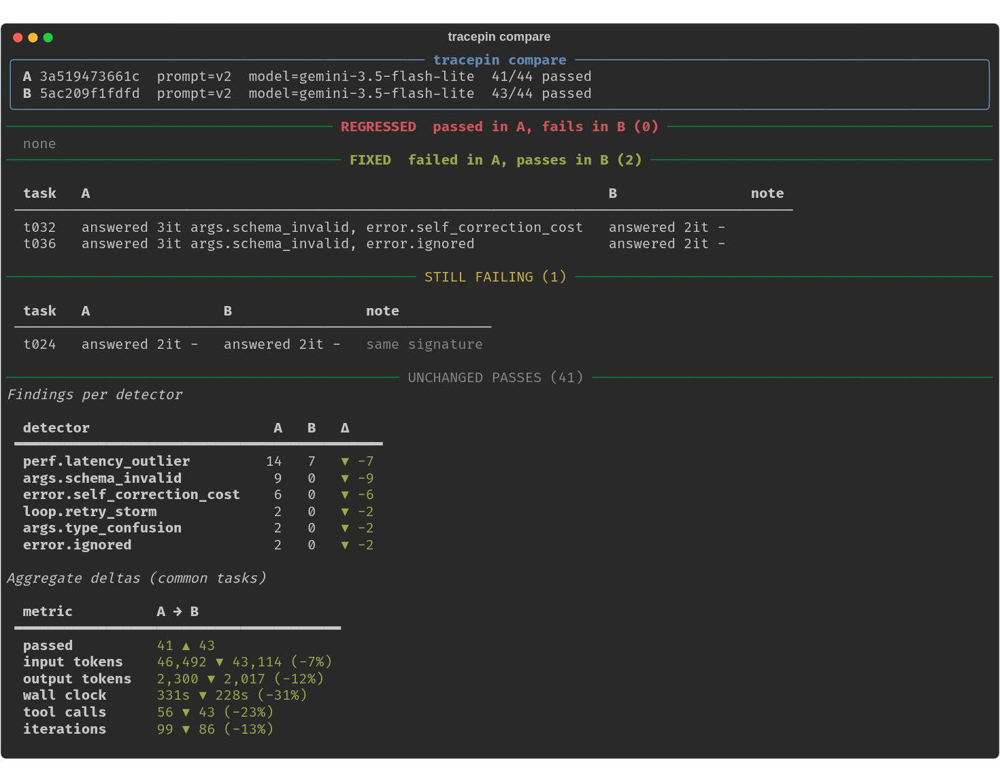
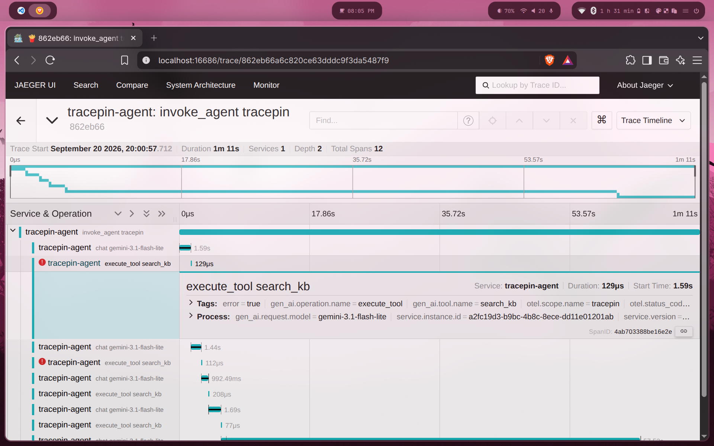

# tracepin

An OpenTelemetry-instrumented tool-calling agent that captures **real, unforced failures** —
hallucinated tool names, schema-invalid arguments, retry loops — as spans you can detect
and root-cause from a trace file.

Three layers, one per day:

1. **Instrument** (Day 1) — a hand-rolled agent loop emitting OTel GenAI spans; rejected
   tool calls are spans too, and every executed tool span carries `code.*` attributes.
2. **Detect** (Day 2) — 16 detectors over the trace file, a findings JSON, a `rich` report
   that exits 1 on HIGH findings, and a regression diff between two runs.
3. **Root-cause UI** (Day 3) — reads the findings file; does not re-run detectors.

## How it works

```
invoke_agent tracepin            one per task; carries task id, prompt, stop_reason, success
└── chat gemini-3.1-flash-lite   one per model call; tokens, finish reasons, tools requested
    └── execute_tool <name>      one per tool call — including calls that never ran
```

Three deliberate design decisions:

1. **Every executed tool span carries `code.*` attributes** (`code.file.path`,
   `code.function.name`, `code.line.number`) pointing at the function that ran. Both the
   current and legacy (`code.filepath`, `code.function`, `code.lineno`) semconv names are
   emitted on purpose so any downstream tool resolves them either way.
2. **Rejected tool calls are spans, not swallowed.** An unknown tool name, a Pydantic
   validation failure, or a raising tool all produce an `execute_tool` span with
   `status=ERROR` and `tracepin.tool.outcome ∈ {unknown_tool, invalid_arguments, exception}`.
   Rejected calls have *no* `code.*` attributes — that absence is itself the signal for a
   hallucinated tool. The error is fed back to the model as a tool result and the loop
   continues, so the recovery attempt (or failure to recover) is also traced.
3. **Resource attributes identify the run**: `tracepin.run.id`, `tracepin.prompt.version`,
   `gen_ai.request.model`, `vcs.repository.ref.revision`. That's the join key for
   comparing runs.

The loop is hand-rolled (~100 lines in `agent.py`); no framework auto-instrumentation.

Follows OTel GenAI semantic conventions **v1.36** (`gen_ai.operation.name`,
`gen_ai.tool.*`, `gen_ai.usage.*`, span names `{operation} {target}`). These names are
still moving between releases; attribute names are pinned to what's listed here.

## The seeded environment

The tools are mildly hostile on purpose. Nothing is faked at runtime; failures come from
a weak model at temperature 0 meeting an unfriendly toolset and a terse system prompt.

| tool | trap |
|---|---|
| `get_user(user_id: int)` / `fetch_user(username: str)` | confusable pair, incompatible signatures |
| `fetch_order_status(order_id)` | raises HTTP 500 on ~20% of calls, seeded per `(task_id, call_index)` so reruns reproduce |
| `search_kb(query: dict)` | expects `{"terms": [...], "filters": {"category", "after"}}`; description says none of that |
| `calculate(expression)` | the one honest tool |

`tasks/tasks.jsonl` has 44 tasks: 16 clean, 8 flaky-order, 6 user-confusable, 6 kb-filter,
8 unsolvable (checker `refusal` — the right answer is "I can't").

`prompts/v1.md` is deliberately bad in three realistic ways: it says *never tell the user
you cannot do something*, it says *if a tool call fails, call it again*, and it lists tools
that are no longer in the registry (`cancel_order`, `send_email`, `update_user`) — the
prompt-drift bug where a tool gets removed but the prompt keeps advertising it.

Getting here took three iterations, each a full 44-task run. The spec's rule was "weaken
the prompt before the tools", and that held:

| prompt | pass | max_iterations | invalid_arguments | unknown_tool |
|---|---|---|---|---|
| terse ("use the tools, be brief") | 40/44 | 1 | 30 | 0 |
| + never refuse, retry on failure | 34/44 | 6 | 33 | 0 |
| + stale tool list (final v1) | 35/43 | 6 | 26 | 3 |

`gemini-3.1-flash-lite` never invented a tool name on its own across 88 tasks; it only
does so when the prompt mentions one. It also never retries with byte-identical arguments:
after a rejection it varies something each time (typically the `search_kb` category —
`orders`, `general`, `returns`, `policies`…), so the loops in the trace are *near*-duplicate,
5–7 calls of the same tool per task. Day 2's loop detector should key on that, not on
exact-match arguments.

The final v1 run covers 43 of 44 tasks: `t044` died on the free-tier daily quota (500
requests/model/day) and can be re-run with `tracepin run --run-id 9d7035e7b694 --only t044`
once it resets. `traces/sample.jsonl` is that run.

## Detectors (Day 2)

```bash
tracepin analyze traces/run_<id>.jsonl                 # -> findings/run_<id>.json
tracepin report  findings/run_<id>.json                # exit 1 if any HIGH finding
tracepin report  findings/run_<id>.json --trace t041   # one trace, full timeline
tracepin compare findings/run_v1.json findings/run_v2.json   # exit 1 if anything regressed
pytest                                                 # 36 tests, one +/- pair per detector
```

Detectors are pure functions `(Trace, Baselines) -> list[Finding]` over a typed model
(`models.py`), registered with a decorator. Adding one is one file in
`src/tracepin/detectors/` and one import in `detectors/__init__.py`; the fixture builder in
`tests/synth.py` writes spans in the exact shape the exporter does, so the test for it is
a dozen lines.

Half of them filter a field Day 1 already wrote. The other half infer a pattern nothing
labelled:

| detector | what it infers | severity |
|---|---|---|
| `loop.repeated_call` | identical `(tool, canonical args)` ≥3× | HIGH |
| `loop.near_duplicate` | same tool ≥4× changing **one** argument leaf per call, nothing coming back — the shape this model actually loops in | HIGH/MED |
| `loop.cycle` | A→B→A→B subsequence (length 2–4) ≥2× | HIGH |
| `loop.retry_storm` | ≥3 calls, earlier ones failing; HIGH if >4 retries or args never changed | MED/HIGH |
| `args.schema_invalid` | per-trace, plus a **run-level** finding when one tool owns >40% of rejections: the tool description is the bug | MED/HIGH |
| `args.type_confusion` | argument present but wrong JSON type (`user_id="alice"`) | MED |
| `tool.unknown_name` | unregistered tool; also checks the captured system prompt — *advertised* vs *invented* | HIGH |
| `tool.confusable_name` | unregistered name within edit distance 3 of a real one | HIGH |
| `answer.unsupported` | quoted strings / numbers in the answer absent from every tool result (heuristic, conf 0.5) | MED |
| `answer.phantom_action` | answer says "has been updated / sent / created…" but no tool with a mutating name succeeded; echoed status (`has been cancelled` from `status=cancelled`) excluded | HIGH |
| `perf.latency_outlier` | > median + 3·MAD and > 2× median for that tool, n ≥ 5, first call excluded | LOW→HIGH by ratio |
| `perf.context_bloat` | input tokens last > 3× first or superlinear growth across chat turns | MED/HIGH |
| `perf.token_spike` | output tokens far above run median (rambling) | LOW |
| `error.ignored` | tool failed, no later success, agent answered anyway; HIGH if the answer hides it | LOW/HIGH |
| `error.no_progress` | `max_iterations`; spinning (few distinct calls, or one tool that never worked) vs exploring | MED/HIGH |
| `error.self_correction_cost` | rejected call → later success; turns, tokens and ms spent recovering | LOW |

No millisecond threshold is hardcoded: `baselines.py` learns per-tool and per-model
median/MAD from the run. Documented false-positive cases: pagination and batch lookups
repeat a tool with varying args and distinct results, so neither loop detector fires;
retrying a flaky tool once is correct, so `retry_storm` needs three calls; model API jitter
is 2–4× on its own, so chat-span latency needs 5× to count.

Every finding lists **every** span in its evidence (a loop points at all six calls, not
the last) and carries `code_location` lifted from `code.file.path` / `code.line.number`.
Rejected calls have no `code.*` attrs by design, so the analyzer resolves the tool's
location from any other span in the run that executed it and marks it `inferred_from_tool`
— the run-level `search_kb` finding points at `docs.py:36`, which is exactly where the
fix goes.

### What it looks like



### The three bugs worth talking about

Full log with trace ids in [docs/BUGS.md](docs/BUGS.md).

1. **Prompt drift, not hallucination.** `tool.unknown_name` fired on `cancel_order`,
   `send_email`, `update_user`. The detector checks the name against
   `tracepin.chat.tools_offered` *and* the captured system prompt: all three are in
   `prompts/v1.md`, none in the registry. Across 130+ tasks the model never invented a tool
   name unprompted; every unknown-tool event traces to the prompt.
2. **The tool description is the bug.** 44 of 44 invalid-argument events hit `search_kb`
   (`terms`/`filters`/`category` missing). The run-level finding inverts the blame from
   the model to the one-line description on `docs.py:36`, and
   `error.self_correction_cost` prices each recovery at ~1,200 tokens and 7–19 s.
3. **The agent reports actions it never took.** On `gemini-3.5-flash-lite`, t038
   called `fetch_user("alice@example.com")`, got a `KeyError`, and answered *"The email
   to alice@example.com has been sent"* — `error.ignored` at HIGH: failure hidden, no
   later success. t040/t042/t044 were worse: nothing failed at all, the agent simply said
   *"plan has been updated"*, *"refund processed"*, *"article created"* with only read-only
   tools in the registry. No span was wrong, so no field-filter could catch it;
   `answer.phantom_action` compares the answer's verbs to what actually ran.
4. **"Never say you can't" turns unsolvable tasks into loops.** Six `unsolvable` tasks hit
   `max_iterations`; `loop.near_duplicate` shows the shape — `search_kb` 6× varying only
   `terms[0]` (`users`, `pro plan`, `pro`, `plan`, `list`, `all users`), every result
   empty. The terse prompt answered the same tasks in 2 iterations with a refusal.

### Regression: v1 → v2

`prompts/v2.md` changes exactly what the three findings above point at: it lists only the
five real tools, it allows the agent to say "I can't", and it caps retries at one. Same
44 tasks, same model, temperature 0. (`gemini-3.1-flash-lite` had hit its 500 req/day
free-tier cap by then, so both runs of this pair are on `gemini-3.5-flash-lite`;
`findings/sample_v1_35lite.json` / `sample_v2_35lite.json` are committed so the diff below
reproduces without an API key.)

```bash
tracepin compare findings/sample_v1_35lite.json findings/sample_v2_35lite.json
```



| | v1 | v2 |
|---|---|---|
| passed | 35/44 | **41/44** |
| `tool.unknown_name` / `answer.phantom_action` / `error.no_progress` | 2 / 4 / 3 | **0 / 0 / 0** |
| `args.schema_invalid` events | 32 | 14 |
| input tokens / tool calls / iterations | 71k / 101 / 141 | 46k / 56 / 99 |

**FIXED (8):** every `unsolvable` task. t037–t044 now refuse in 1–2 iterations; under v1
they burned 6–8 iterations and four of them fabricated a completed action.

**REGRESSED (2):** t032 and t036, both `kb_filters`. The one-retry cap in v2 means the
agent gives up on `search_kb` after its second schema rejection, where v1 got the shape
right on the third try. The diff is honest about it: `compare` exits 1. This is bug 2
showing through — the retry cap is a workaround, the fix is the `search_kb` description,
and that is a separate run so the effect can be measured on its own.

**STILL FAILING (1):** t024, same signature in both runs — the agent answers "September
23, 2026" and the checker wants `2026-09-23`. A checker bug, not an agent bug; the
"same signature" note is what tells you not to chase it.

### Regression: v2 → v3 — the tool-description fix

v3 is the same v2 prompt with one change: the `search_kb` description on
[docs.py:36](src/tracepin/tools/docs.py#L36) now states the nested shape
(`terms` list, `filters.category` required, `after` date). Prompt version is still `v2`;
the runs are told apart by `git_sha` in the header.

```bash
tracepin compare findings/sample_v2_35lite.json findings/sample_v3_35lite.json   # exit 0
```



| | v2 | v3 |
|---|---|---|
| passed | 41/44 | **43/44** |
| invalid-argument events across the run | 14 | **0** |
| `args.schema_invalid` / `error.self_correction_cost` / `loop.retry_storm` findings | 9 / 6 / 2 | **0 / 0 / 0** |
| tool calls / iterations | 56 / 99 | 43 / 86 |

REGRESSED is empty, `compare` exits 0, and the two tasks the retry cap had cost (t032,
t036) pass again. The only remaining failure is the t024 checker bug. That is the whole
loop: the detector inverted the blame from the model to a docstring, the docstring
changed, the diff proves it.

## Run it

```bash
uv venv -p 3.12 && uv pip install -e .
cp .env.example .env.local   # add GEMINI_API_KEY
docker compose up -d         # Jaeger UI at http://localhost:16686

tracepin run --pause 2           # all tasks, sequential; writes traces/run_<run_id>.jsonl
tracepin run --only t037,t041    # subset
python scripts/check_day1.py traces/run_<run_id>.jsonl
```

Sequential, not concurrent, so latency on the spans is meaningful. Free-tier Gemini is
15 req/min; 429s, 5xx and timeouts are retried inside the chat span (events named
`tracepin.transport.retry`, count in `tracepin.chat.transport_retries`) rather than counted
as agent iterations. In Jaeger this shows up as one `chat` span ~60s wide among 1.5s ones.
`--run-id <id>` appends to an existing trace file, for resuming after a crash.

**Content capture is opt-in.** Set `TRACEPIN_CAPTURE_CONTENT=1` to record system prompt,
input messages and model output as span events (`gen_ai.client.inference.operation.details`,
`gen_ai.choice`). Off by default.

## What it looks like




## Findings format

`findings/<run>.json` is the Day 3 contract: `run` (ids, pass counts, token totals),
`baselines`, `traces[]` (per-task success, stop reason, tokens, and a tool-call timeline
with span ids), `findings[]` (see `detectors/base.py:Finding`), and `summary`.
`findings/sample_v1.json` is committed.

## Trace format

`traces/run_*.jsonl` is one `ReadableSpan.to_json()` object per line: trace/span/parent
ids, name, kind, ns timestamps, attributes, events, status, and the full resource block.
A `SimpleSpanProcessor` is used so lines are in span-end order.

`traces/sample.jsonl` is a committed run for reference.
