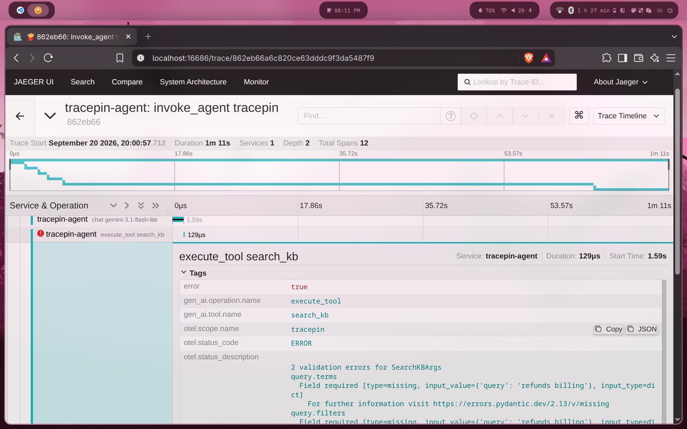

# tracepin

An OpenTelemetry-instrumented tool-calling agent that captures **real, unforced failures** —
hallucinated tool names, schema-invalid arguments, retry loops — as spans you can detect
and root-cause from a trace file.

Day 1 scope (this commit range): emit correct spans, run 44 seeded tasks, produce a trace
file with genuine bugs in it. No detectors, no UI yet.

## How it works

```
invoke_agent tracepin            one per task; carries task id, prompt, stop_reason, success
└── chat gemini-3.1-flash-lite   one per model call; tokens, finish reasons, tools requested
    └── execute_tool <name>      one per tool call — including calls that never ran
```

Three deliberate design decisions:

1. **Every executed tool span carries `code.*` attributes** (`code.file.path`,
   `code.function.name`, `code.line.number`) pointing at the function that ran. Both the
   current and legacy (`code.filepath`, `code.function`, `code.lineno`) semconv names are
   emitted on purpose so any downstream tool resolves them either way.
2. **Rejected tool calls are spans, not swallowed.** An unknown tool name, a Pydantic
   validation failure, or a raising tool all produce an `execute_tool` span with
   `status=ERROR` and `tracepin.tool.outcome ∈ {unknown_tool, invalid_arguments, exception}`.
   Rejected calls have *no* `code.*` attributes — that absence is itself the signal for a
   hallucinated tool. The error is fed back to the model as a tool result and the loop
   continues, so the recovery attempt (or failure to recover) is also traced.
3. **Resource attributes identify the run**: `tracepin.run.id`, `tracepin.prompt.version`,
   `gen_ai.request.model`, `vcs.repository.ref.revision`. That's the join key for
   comparing runs.

The loop is hand-rolled (~100 lines in `agent.py`); no framework auto-instrumentation.

Follows OTel GenAI semantic conventions **v1.36** (`gen_ai.operation.name`,
`gen_ai.tool.*`, `gen_ai.usage.*`, span names `{operation} {target}`). These names are
still moving between releases; attribute names are pinned to what's listed here.

## The seeded environment

The tools are mildly hostile on purpose. Nothing is faked at runtime; failures come from
a weak model at temperature 0 meeting an unfriendly toolset and a terse system prompt.

| tool | trap |
|---|---|
| `get_user(user_id: int)` / `fetch_user(username: str)` | confusable pair, incompatible signatures |
| `fetch_order_status(order_id)` | raises HTTP 500 on ~20% of calls, seeded per `(task_id, call_index)` so reruns reproduce |
| `search_kb(query: dict)` | expects `{"terms": [...], "filters": {"category", "after"}}`; description says none of that |
| `calculate(expression)` | the one honest tool |

`tasks/tasks.jsonl` has 44 tasks: 16 clean, 8 flaky-order, 6 user-confusable, 6 kb-filter,
8 unsolvable (checker `refusal` — the right answer is "I can't").

`prompts/v1.md` is deliberately bad in three realistic ways: it says *never tell the user
you cannot do something*, it says *if a tool call fails, call it again*, and it lists tools
that are no longer in the registry (`cancel_order`, `send_email`, `update_user`) — the
prompt-drift bug where a tool gets removed but the prompt keeps advertising it.

Getting here took three iterations, each a full 44-task run. The spec's rule was "weaken
the prompt before the tools", and that held:

| prompt | pass | max_iterations | invalid_arguments | unknown_tool |
|---|---|---|---|---|
| terse ("use the tools, be brief") | 40/44 | 1 | 30 | 0 |
| + never refuse, retry on failure | 34/44 | 6 | 33 | 0 |
| + stale tool list (final v1) | see `traces/run_v1.log` | | | |

`gemini-3.1-flash-lite` never invented a tool name on its own across 88 tasks; it only
does so when the prompt mentions one. The earlier runs are kept in `traces/` for comparison.

## Run it

```bash
uv venv -p 3.12 && uv pip install -e .
cp .env.example .env.local   # add GEMINI_API_KEY
docker compose up -d         # Jaeger UI at http://localhost:16686

tracepin --pause 2           # all tasks, sequential; writes traces/run_<run_id>.jsonl
tracepin --only t037,t041    # subset
python scripts/check_day1.py traces/run_<run_id>.jsonl
```

Sequential, not concurrent, so latency on the spans is meaningful. Free-tier Gemini is
15 req/min; 429s, 5xx and timeouts are retried inside the chat span (events named
`tracepin.transport.retry`, count in `tracepin.chat.transport_retries`) rather than counted
as agent iterations. In Jaeger this shows up as one `chat` span ~60s wide among 1.5s ones.
`--run-id <id>` appends to an existing trace file, for resuming after a crash.

**Content capture is opt-in.** Set `TRACEPIN_CAPTURE_CONTENT=1` to record system prompt,
input messages and model output as span events (`gen_ai.client.inference.operation.details`,
`gen_ai.choice`). Off by default.

## What it looks like



## Trace format

`traces/run_*.jsonl` is one `ReadableSpan.to_json()` object per line: trace/span/parent
ids, name, kind, ns timestamps, attributes, events, status, and the full resource block.
A `SimpleSpanProcessor` is used so lines are in span-end order.

`traces/sample.jsonl` is a committed run for reference.
